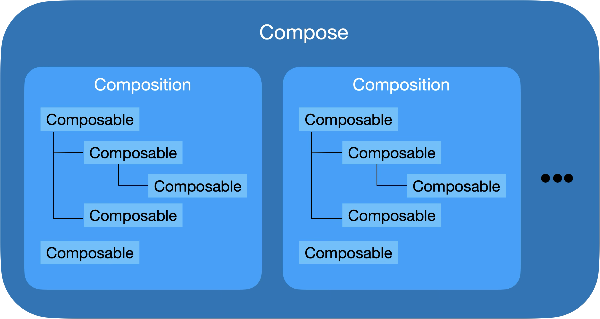

# Composition·Composable·Composition 관계 정리

Jetpack Compose를 처음 학습하면 가장 먼저 마주하는 개념이 있다. 바로 **Compose, Composable, Composition** 이 세 가지다.
단어 형태도 비슷하고, 문서에서도 계속 반복되기 때문에 정확히 구분해야지만 Jetpack Compose 전반의 구조가 선명해진다.

## 1. 관계 개요
다음 그림은 Compose, Composable, Composition 관계를 나타낸 것이다.



Compose는 전체 UI 시스템을 관리하며, 그 내부에는 여러 개의 Composition이 동시에 존재할 수 있다.
각 Composition은 하나의 `setContent{}` 호출 또는 하나의 `ComposeView`를 통해 생성되며, 해당 UI를 구성하는 **Composable 함수들의 트리 구조**를 유지한다.

그림에서 볼 수 있듯이 
- **Compose**: 전체 Composition들을 감싸고 관리하는 최상위 컨트롤러
- **Composition**: Composable 함수들이 실제로 실행되어 만들어진 UI 트리 구조
- **Composable**: UI를 선언하는 함수이며 Composition 내부에서는 노드 형태로 배치되어 트리를 구성

즉, **Composable을 실행하면 Composition이 만들어지고, 이 Composition들을 통합적으로 관리하는 시스템이 Compose이다.**


## 2. Compose: 전체를 관리하는 시스템(런타임 + 프레임워크)
Compose는 Jetpack Compose UI Toolkit의 핵심 엔진으로 다음과 같은 역할을 한다.
- **Composable 실행**: Composable 함수를 실제로 실행해 UI 트리 구조를 분석한다.
- **Composition 생성 및 관리**: Composable의 실행 결과를 UI 트리 구조(**Composition**)으로 유지한다.
- **Recomposition 관리**: `State` 변화를 감지하고 해당 `State`를 직접적으로 사용하는 Composable만 다시 실행하도록 스케줄링한다.

즉, Compose는 UI 선언부터 상태 기반 업데이트까지 모든 과정을 관리하는 중앙 컨트롤러다.

## 3. Composable: UI를 선언하는 함수(설계도)
Composable은 `@Composable` 어노테이션을 가진 **UI 선언 함수**이다.

다시 말해 Composable은 "무엇을 그릴지 설명"하는 것이다.

## 4. Composition: Composable 실행 결과로 만들어진 UI 트리
Composition은 Composable을 실행해 얻은 실제 UI 구조를 담는 트리다.


``` kotlin
@Composable
fun HomeScreen() {
    Column {
        TopBanner()
        HomeMenu()
        Navigation()
    }
}
```
예를 들어 `HomeScreen()` 내부에 `TopBanner()`, `HomeMenu()`, `Navigation()`을 실행하면 Composition은 다음과 같은 트리를 관리한다.


``` 
HomeScreen
 └── Column
      ├── TopBanner
      ├── HomeMenu
      └── Navigation
```

추가적으로 Composition은 다음과 같은 특징을 갖는다.
- **`setContent{}` 호출당 Composition 1개 생성**
- 최초에 Initial Composition 생성
- 그 이후에는 Recomposition으로만 업데이트
