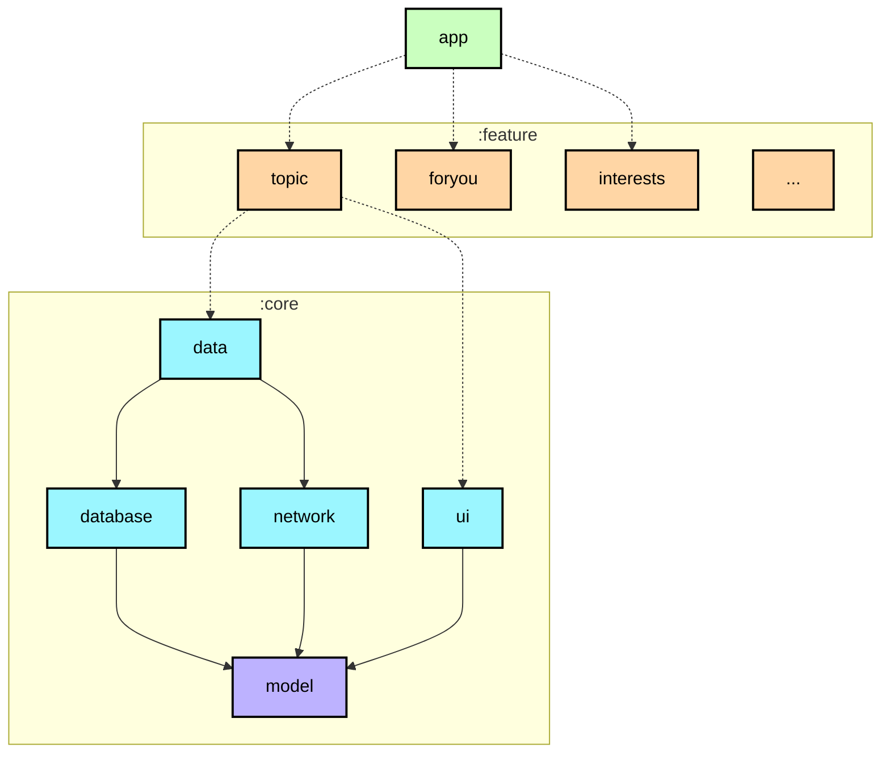
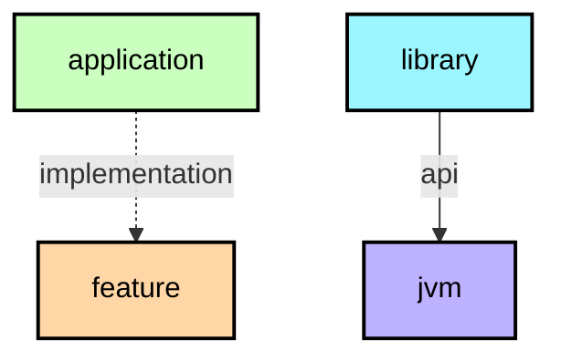

## Now In Android 모듈 유형 

📋 Graph legend

> Top tip: 위에 있는 모듈 그래프는 각 모듈 간 의존성을 시각적으로 표현한 것으로, 모듈화를 설계하거나 리팩토링할 때 매우 유용하게 사용할 수 있다.

Now In Android 앱은 크게 다음과 같은 유형의 모듈들로 구성되어 있다.

### `app` 모듈
`app` 모듈은 앱 전역에서 사용하는 클래스를 갖고 있으며, 전체 코드베이스를 연결하는 Application entry point 역할을 한다.
예를 들어 `MainActivity`, `NiaApp`, 앱 전체 내비게이션을 정의하는 `NiaNavHost` 그리고 하단 내비게이션을 구성하는 `TopLevelDestination` 등이 모두 `app` 모듈에 속한다.

의존 관계: `app` 모듈은 모든 `feature` 모듈과 필요한 `core` 모듈에 의존한다.

### `feature` 모듈
`feature` 모듈은 앱 안의 특정 기능이나 화면, 혹은 하나의 도메인을 완전히 담당하는 독립적인 모듈이다. 각 모듈은 오직 자신이 맡은 기능만 책임지고, 다른 기능과의 불필요한 결합을 피해야 한다.
이렇게 분리된 모듈은 테스트 앱이나 다른 앱에서 그대로 재사용될 수 있으며, 각 기능이 서로 간섭하지 않도록 중심을 잡아준다.

특정 클래스가 한 `feature`에서만 사용된다면 해당 모듈 안에 그대로 유지하는 것이 맞다. 하지만 여러 `feature`에서 공유되어야 한다면 `core` 모듈로 이동하는 것이 적절하다.

의존 관계: `feature` 모듈은 `core` 모듈에 의존할 수 있지만, 다른 `feature` 모듈에 의존하거나 `app` 모듈에 의존할 수 없다.

### `core` 모듈
`core` 모듈은 앱 안의 다른 모듈들이 함께 사용해야 하는 공통 라이브러리 성격의 코드와 특정 의존성을 담고 있는 모듈들을 의미한다.

의존 관계: `core` 모듈은 다른 `core` 모듈에 의존할 수 있지만, `feature`나 `app` 모듈에 의존하면 안 된다.

### 기타 모듈
기타(Miscellaneous) 모듈은 `sync`, `benchmark`, `test` 같은 용도별 모듈을 비롯해, 디자인 시스템을 빠르게 확인할 수 있도록 만들어진 별도의 작은 앱인 `app-nia-catalog` 같은 모듈들을 의미한다.
